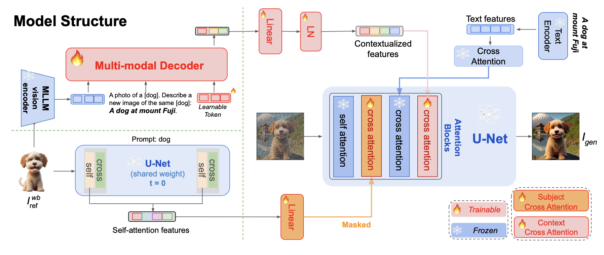
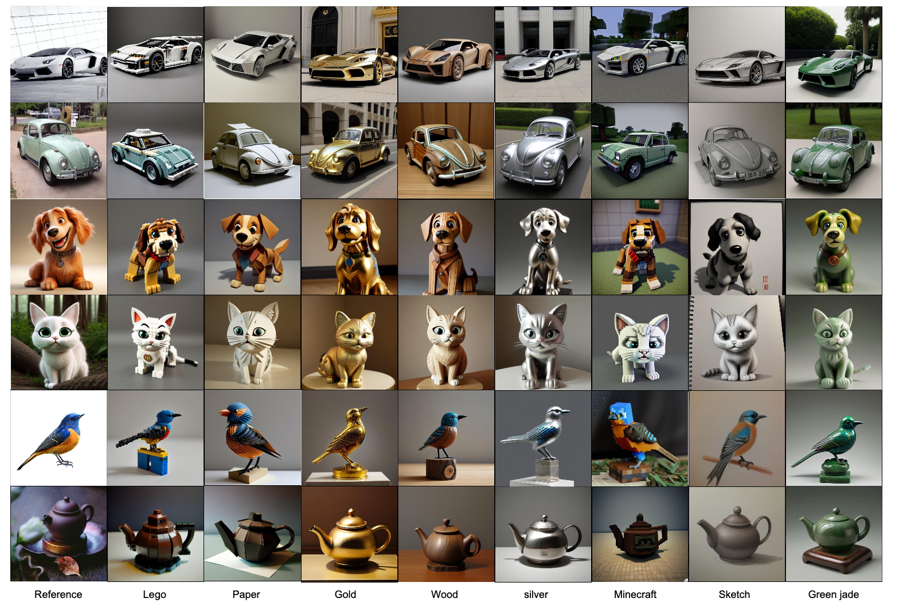

# ___***MoMA: Multimodal LLM Adapter for Fast Personalized Image Generation***___

<a href='https://moma-adapter.github.io/'></a> 
<a href='https://arxiv.org/abs/2404.05674'></a> 
<a href='https://huggingface.co/KunpengSong/MoMA_llava_7b/tree/main'></a>


---


## Introduction

we present MoMA: an open-vocabulary, training-free personalized image model that boasts flexible zero-shot capabilities. As foundational text-to-image models rapidly evolve, the demand for robust image-to-image translation grows. Addressing this need, MoMA specializes in subject-driven personalized image generation. Utilizing an open-source, Multimodal Large Language Model (MLLM), we train MoMA to serve a dual role as both a feature extractor and a generator. This approach effectively synergizes reference image and text prompt information to produce valuable image features, facilitating an image diffusion model. To better leverage the generated features, we further introduce a novel self-attention shortcut method that efficiently transfers image features to an image diffusion model, improving the resemblance of the target object in generated images. Remarkably, as a tuning-free plug-and-play module, our model requires only a single reference image and outperforms existing methods in generating images with high detail fidelity, enhanced identity-preservation, and prompt faithfulness. We commit to making our work open-source, thereby providing universal access to these advancements.



## Release
- [2024/04/20] 🔥 We release the model code on GitHub.
- [2024/04/22] 🔥 We add HuggingFace repository and release the checkpoints.


## Installation
1. Install LlaVA: 
Please install from its [official repository](https://github.com/haotian-liu/LLaVA#install)

2. Download our MoMA repository

```
git clone https://github.com/KunpengSong/MoMA.git
cd MoMA
pip install -r requirements.txt
```

## Memory Requirements
We support 8-bit and 4-bit inferences which reduce memory consumptions: 
+ If you have 22 GB or more GPU memory:
```args.load_8bit, args.load_4bit = False, False```

+ If you have 18 GB or more GPU memory:
```args.load_8bit, args.load_4bit = True, False```

+ If you have 14 GB or more GPU memory:
```args.load_8bit, args.load_4bit = False, True```


## Download Models

**You don't have to download any checkpoints**, our code will automatically download them from [HuggingFace repositories](https://huggingface.co/KunpengSong/MoMA_llava_7b/tree/main), which includes:
```
VAE: stabilityai--sd-vae-ft-mse
StableDiffusion: Realistic_Vision_V4.0_noVAE
MoMA: 
    Multi-modal LLM: MoMA_llava_7b (13 GB)
    Attentions and mappings: attn_adapters_projectors.th (151 Mb)
```

## How to Use

### SD_1.5 (Realistic_Vision_V4.0)

- If you prefer Jupyter-notebook: [**run_MoMA_notebook.ipynb**](run_MoMA_notebook.ipynb)
- If you prefer Python code: [**run_evaluate_MoMA.py**](run_evaluate_MoMA.py)

New context:

New texture:



**Hyper parameter:**
- In "changing context", you can increase the `strength` to get more accurate details. Mostly,`strength=1.0` is the best. It's recommended that `strength` is no greater than `1.2`.
- In "changing texture", you can change the `strength` to balance between detail accuracy and prompt fidelity. To get better prompt fidelity, just decrease `strength`. Mostly, `strength=0.4` is the best. It's recommended that `strength` is no greater than `0.6`.


## Citation
If you find our work useful for your research and applications, please consider citing us by:
```BibTeX
@article{song2024moma,
  title={MoMA: Multimodal LLM Adapter for Fast Personalized Image Generation},
  author={Song, Kunpeng and Zhu, Yizhe and Liu, Bingchen and Yan, Qing and Elgammal, Ahmed and Yang, Xiao},
  journal={arXiv preprint arXiv:2404.05674},
  year={2024}
}
```
